<h1 align="center">Django Admin Panel + Custom API Views</h1>

<p align="center">
  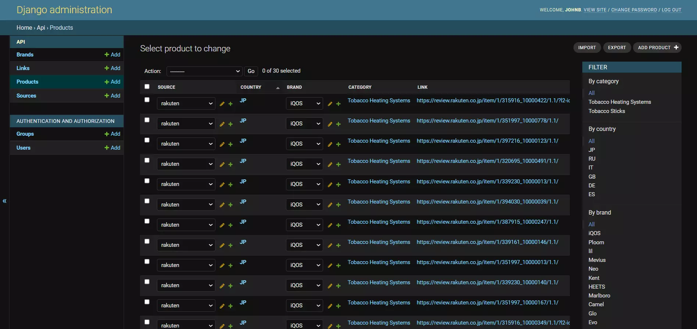
</p>


**Main Task:** 

1. Create Django Admin panel with following list of operations:

	- Add a link
	- Edit a link
	- Delete a link
	- Add a source
	- Edit a source name
	- Add a brand
	- Edit a brand name
	- Export data to `csv`

2. Create API endpoint for export data to `JSON` with 2 optional filters: `country` and
`source`.


### 📝 &nbsp;Requirements

- **dj-database-url** == `0.5.0`
- **Django** == `3.2.7`
- **django-crispy-forms** == `1.12.0`
- **django-extensions** == `3.1.3`
- **psycopg2-binary** == `2.9.1`
- **python-decouple** == `3.4`
- **whitenoise** == `5.3.0`
- **django-import-export** == `2.6.0`
- **gunicorn** == `19.6.0`


### 📷 Part 1 - Admin Panel (with screenshots)

The main implementation of the first task is on the `Products` tab in the admin panel, for the `Source` and `Brand` fields it was developed only to add new elements and change the current ones (this can be done both on the product page and in place through `list_editable`).

The `Link` field can be deleted, modified and new copies added, this can be done on the product page using the buttons next to the field, as in the case of `Brand` and `Source`.

The export of the selected data to the `CSV` was implemented using `actions`:

```python
def export_as_csv(modeladmin, request, queryset):
    meta = modeladmin.model._meta
    field_names = [field.name for field in meta.fields]

    response = HttpResponse(content_type='text/csv')
    response['Content-Disposition'] = 'attachment; filename={}.csv'.format(meta)
    writer = csv.writer(response)

    writer.writerow(field_names)
    for obj in queryset:
        writer.writerow([getattr(obj, field) for field in field_names])

    return response
export_as_csv.short_description = "Export Selected as CSV"
```

Also, the admin panel has the ability to filter values by `Country`, `Brand` and/or `Category` (`list_filter`).

To expand the functionality, the `django-import-export` library was involved, with the help of which the export and import of files in such formats as `csv`, `xls`, `xlsx`, `tsv`, `ods`, `json`, `yaml` and `html` was implemented. To take advantage of this, there are buttons in the upper right corner of the `Products` admin page.

To integrate `django-import-export` with our `Product` model, we will create a `ProductResource` class in `admin.py` that will describe how this resource can be imported or exported:

```python
class ProductResource(resources.ModelResource):
    # we need this five fields to display the actual values that are hidden behind ForeignKeys
    source = fields.Field(column_name='source', attribute='source',
                          widget=ForeignKeyWidget(Source, 'source'))

    country = fields.Field(column_name='country', attribute='country',
                           widget=ForeignKeyWidget(Country, 'country'))

    brand = fields.Field(column_name='brand', attribute='brand',
                         widget=ForeignKeyWidget(Brand, 'brand'))

    category = fields.Field(column_name='category', attribute='category',
                            widget=ForeignKeyWidget(Category, 'category'))

    link = fields.Field(column_name='link', attribute='link',
                        widget=ForeignKeyWidget(Link, 'link'))

    class Meta:
        model = Product
        fields = ('source', 'country', 'brand', 'category', 'link')  # fields to export 
        import_id_fields = ['source', 'country', 'brand', 'category', 'link']  # fields to import 
```

Admin integration is achieved by subclassing `ImportExportModelAdmin`:

```python
@admin.register(Product)
class ProductAdmin(ImportExportModelAdmin):
    ... 
    resource_class = ProductResource
```

Admin Panel (Products)        |  Admin Panel (Product Page) | Add Source     |  Edit Brand
:-------------------------:|:-------------------------:|:-------------------------:|:-------------------------:
 |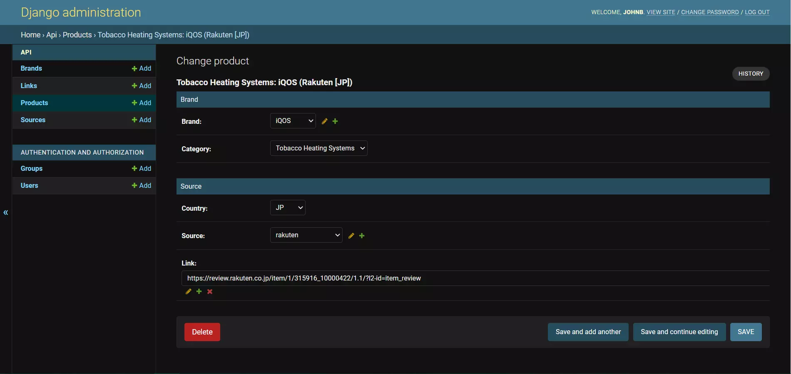|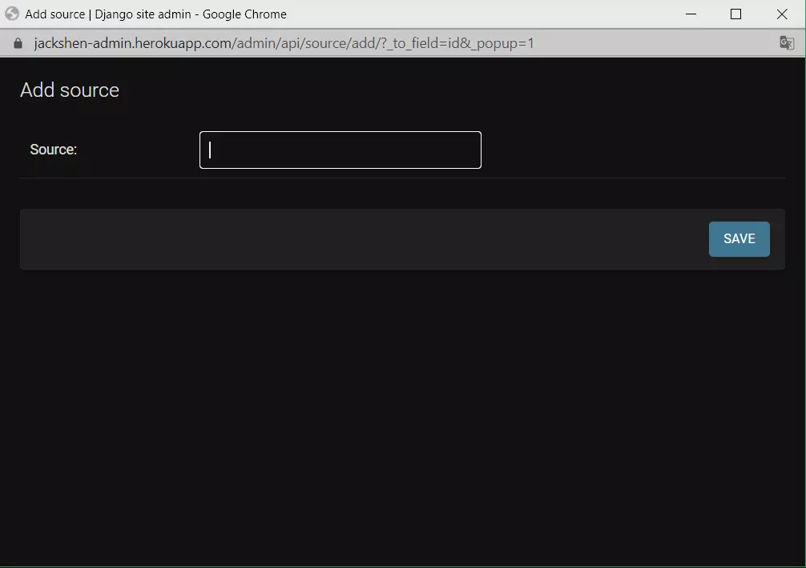 |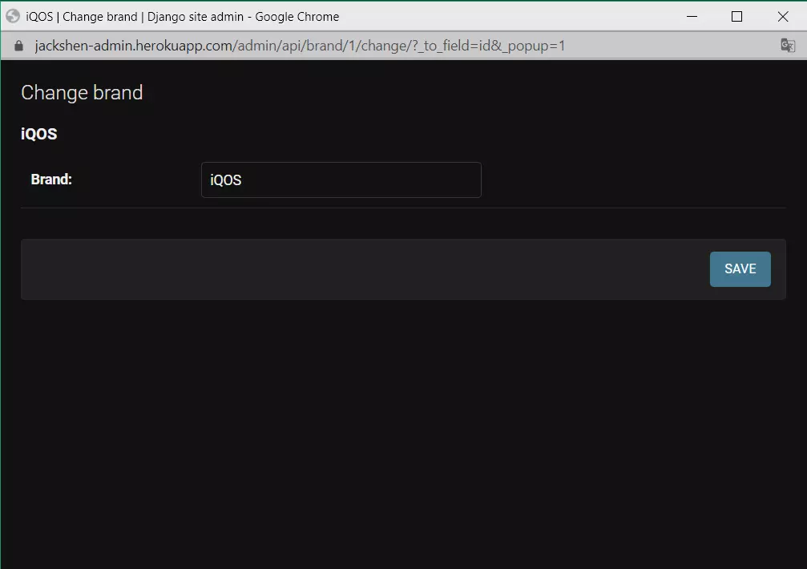

Delete Link        |  Export Page  | Export Result (JSON)     |  Export CSV
:-------------------------:|:-------------------------:|:-------------------------:|:-------------------------:
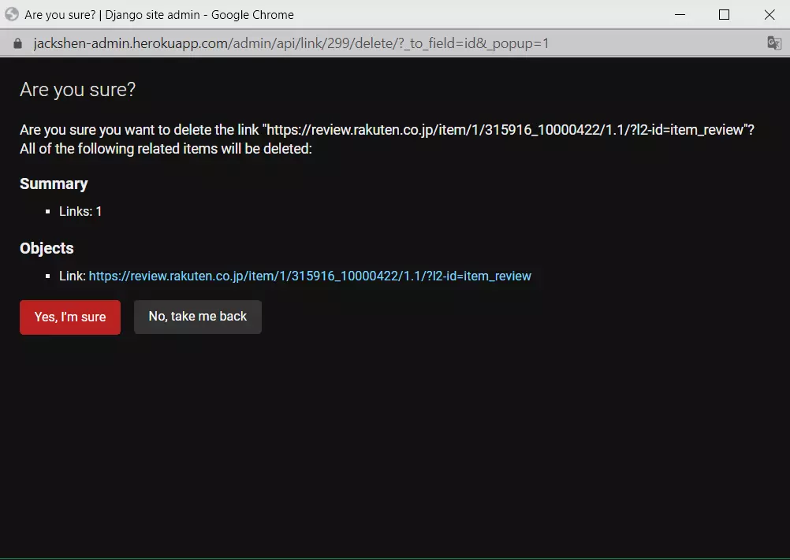 |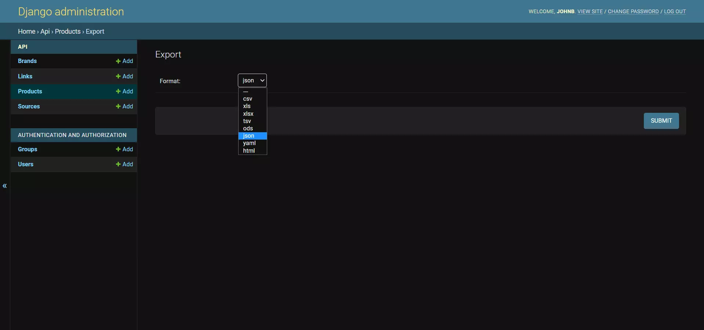|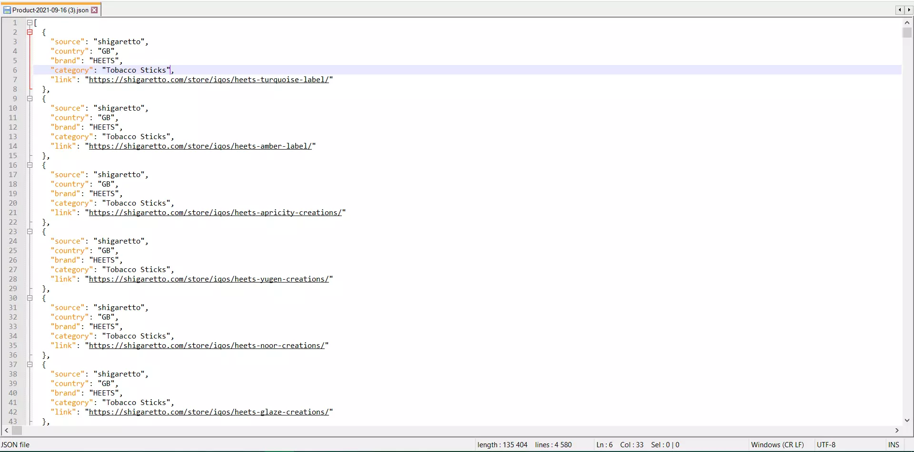 |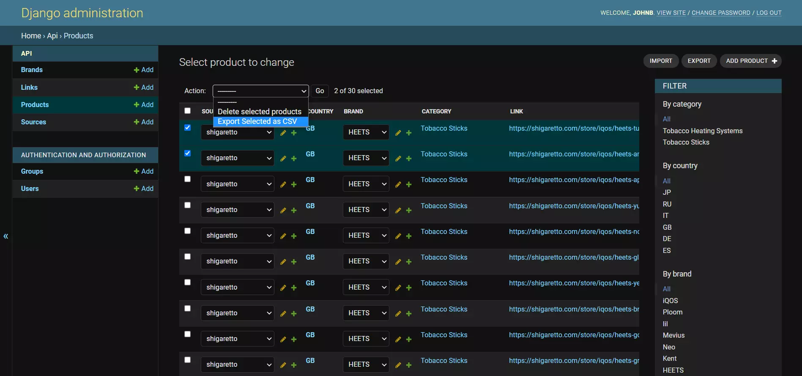

Export Result (CSV)        |  Import Page  | Import Result   
:-------------------------:|:-------------------------:|:---------------------------------:
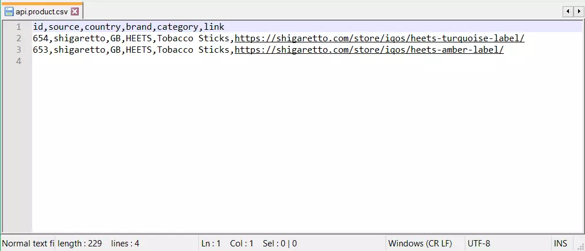 |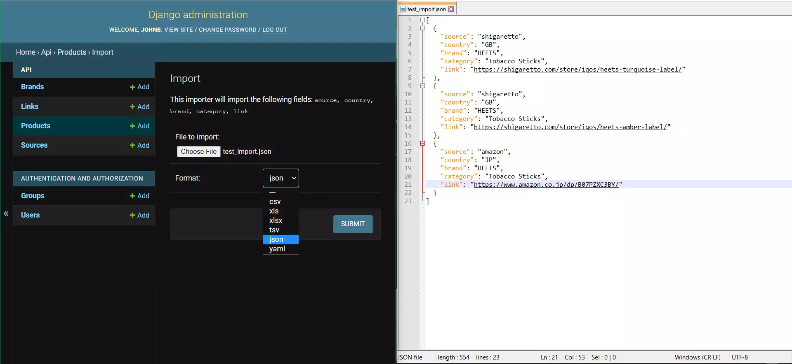|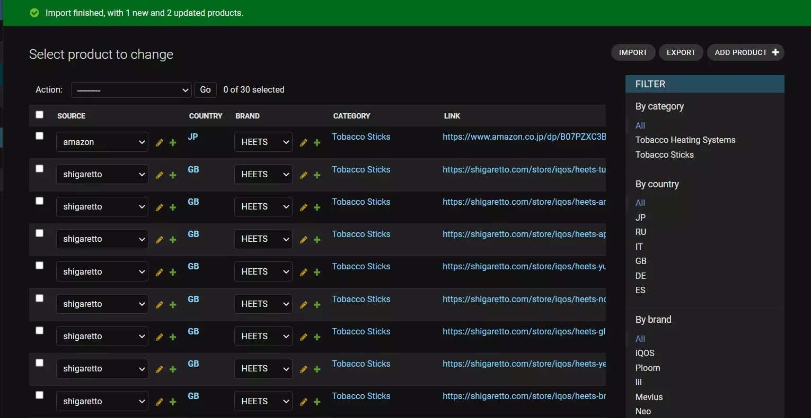


### 📷 Part 2 - Custom API (with screenshots)

The implementation of this part is in folder `api/` and accordingly on url `../api/v1/get/` and `../api/v1/post/`.

`../api/v1/post/` - deals with the creation of new instances of the `Product`, as well as the validation of parameters (validation of the URL and the country).

`../api/v1/get/`- returns a JSON file with `Product` objects and has 2 additional filters: `country` and` source`.

For the convenience of filling in the data for POST I leave the form, but it is easy to change.


Form Example        |  Parameters Validation (Error)  | Parameters Validation (Success)     
:-------------------------:|:-------------------------:|:-------------------------:
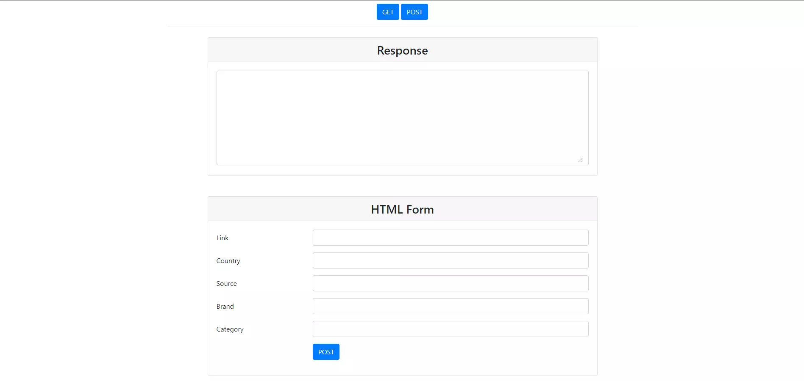 |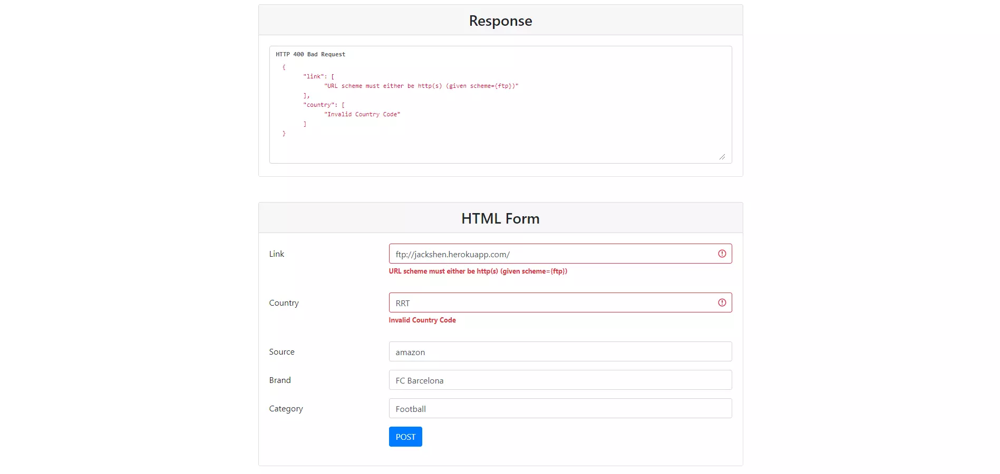|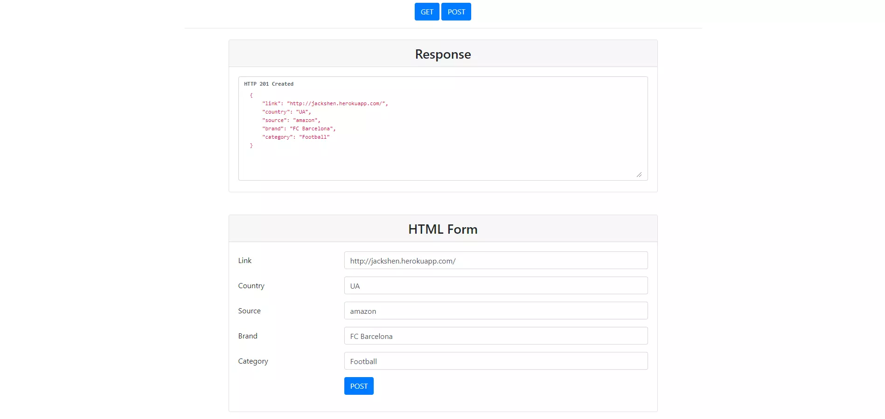


JSON Response (Postman)    |  JSON Response - Filter by Source (Postman) | JSON Response - Filter by Country (Postman)   
:-------------------------:|:-------------------------:|:-------------------------:
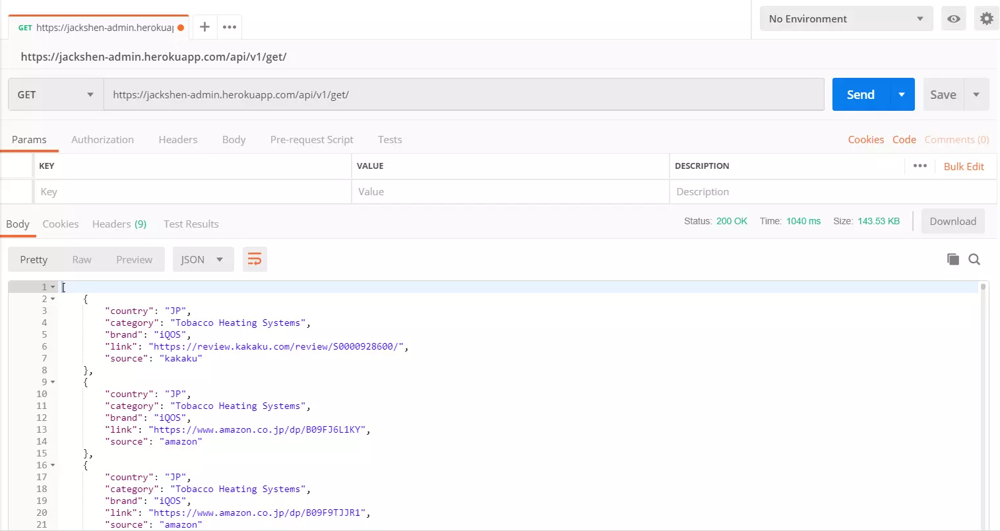 |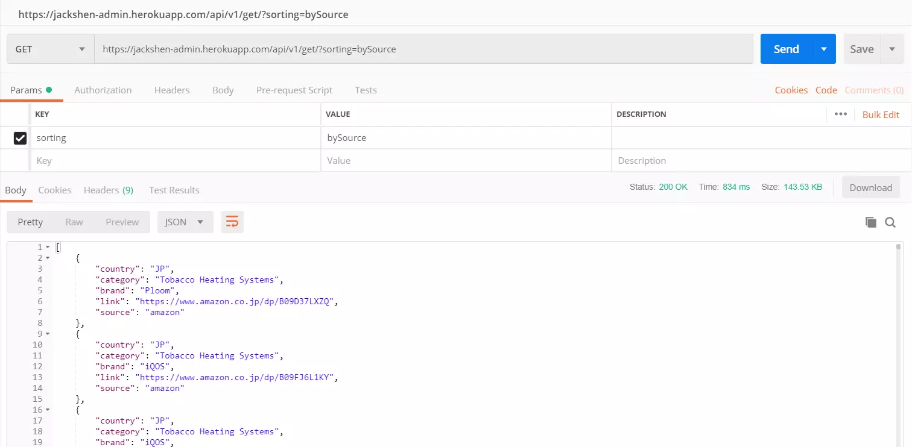|


### 💡 &nbsp;Additional Info

`populate_db.py` script was used to fill the database with data from `ProductLink.csv`

```
python manage.py runscript populate_db
```

[Visit Heroku Website!](https://jackshen-admin.herokuapp.com/)


## 📫 &nbsp;Get in touch

<p align="center">
<a href="https://www.linkedin.com/in/yevhenii-shendrikov-6795291b8/"></a>
<a href="mailto:jackshendrikov@gmail.com"></a>
<a href="https://www.facebook.com/jack.shendrikov"></a>
<a href="https://t.me/jackshen"></a>
</p>
